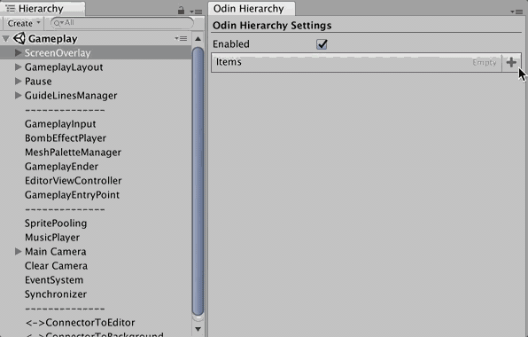
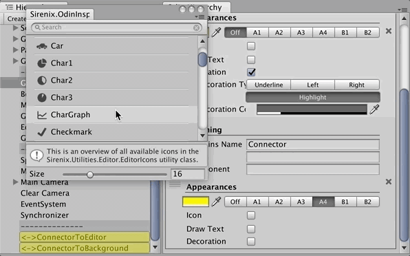
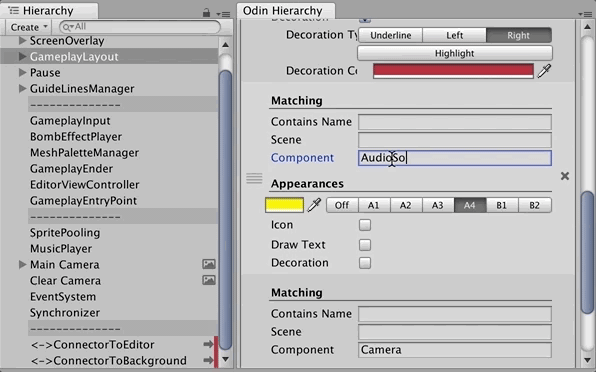
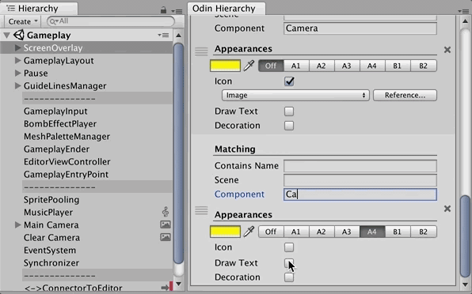
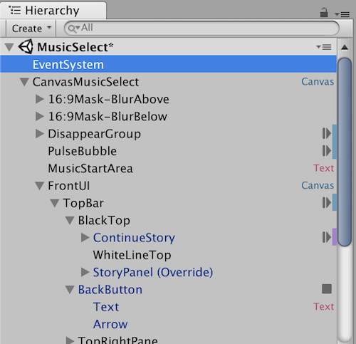

# Odin Hierarchy

Pimp your hierarchy with pattern matching on your game objects... the styling settings is saved along with your project as a `ScriptableObject` file.

The hierarchy function actually does not related to Odin at all but it utilizes Odin Inspector's built-in icons, some drawing methods in `SirenixEditorGUI`, and most importantly making a good editor out of a mere `ScriptableObject` data file.

## How to use

1. The code uses C#6.0 so it requires .NET 4.x settings in the Player Settings.
2. Put the 3 files in `Editor` folder or any assembly with `Editor` include platform that knows Odin.
3. `Window > Odin Hierarchy` to start setting up your hierarchy stylings.

## Usage ideas 

Not sure about you, but I always had trouble looking for `Text`, `Button`, and `Animator` in my uGUI stack. By doing like this it helps me somewhat. 

Now that I have 2 types of `Text` (and `TextMeshPro`) and 2 types of `Animator` (and [`LegacyAnimator`](https://github.com/5argon/E7Unity/tree/master/LegacyAnimator)) you can make them similar but a bit different with color/decoration.

## Notes 

- Game object name match by substring but scene and component must be an exact match.
- It match from top of the list to bottom and choose only one. If you have a game object with both `Button` and `Animator` for example and you have both of them in the settings, it will use the appearance of whichever comes first.
- To match a class with generics, the official C# `Type.Name` of those classes looks like this `` MyGenericClass`1 `` (for `MyGenericClass<T>`)
- Put $ in front of a class matching name to target the immediate base class instead. For example `$MonoBehaviour` will match almost everything.
- You may remove `[CreateAssetMenu]` from the code once you have created the `ScriptableObject` file. You never need an another one.
- I don't have a pro skin to test but it should be fine?
- Right click on the title text and select "Secret" to see hidden fields.