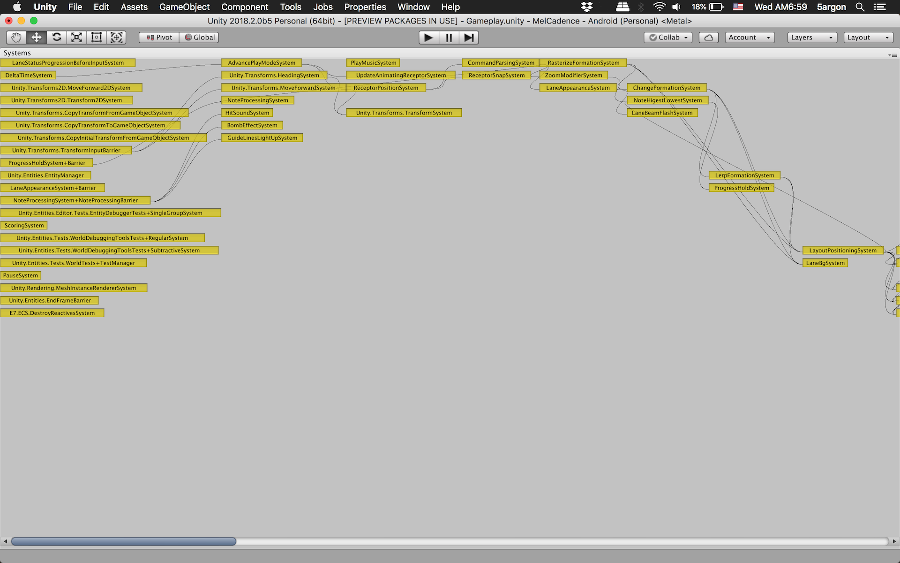

# Unity System Visualizer

It does not work yet just some proof of concept. But the code might be interesting so I put it up.

## Concept

I found interesting `private` method named `CreateSystemDependencyList` in `ScriptBehaviourUpdateOrder.cs` so I tried using reflection and take `List<InsertionBucket>` out to experiment.

Each item is a system and all of its before and after systems. I want to visualize this as a graph. My idea is to start from those without afters as root nodes on the first column.

## Problems
- Very messy code, just screw around for a quick result.
- Barriers are considered root nodes because they don't have any update afters. But in the actual game barrier runs after it gets a command from some system that runs way later.
- I don't know graph theory, how to arrange a graph nicely based on previous/next relationship between nodes without any depth assigned on them? Basically I tried to calculate depth for each one but those depths are bad.
- The traversal code put nodes at some depth way down below. (I intended for each column to start at the top)
- There are some lines that travels backward to the previous column.
- Some line goes under nodes and skips depth.
- The lines are so messy that it barely provide any benefits from looking at them.
- Some "reactive" type system are at the first column. In the actual code they does not have any before/afters so they do go to the first column, but the intention for these systems is to react after some other system put out a message. Before/after dependency could not account for this. (No automatic system could account for this, I think.) 