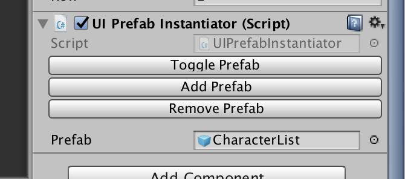
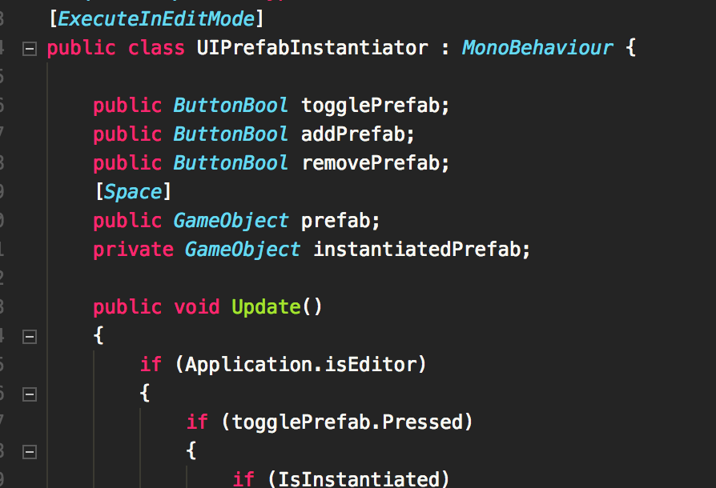

# Button Bool

You can make a makeshift button in the inspector like this.

It is an alternative to `[ContextMenu]` for those who don't want to right click. But you need to code the check manually in your `Update`.

The combo to use it in the code is with `[ExecuteInEditMode]` and a check to `.Pressed`. Note that after the check the internal `bool` will set it to `false`, so never check twice in the same update!

