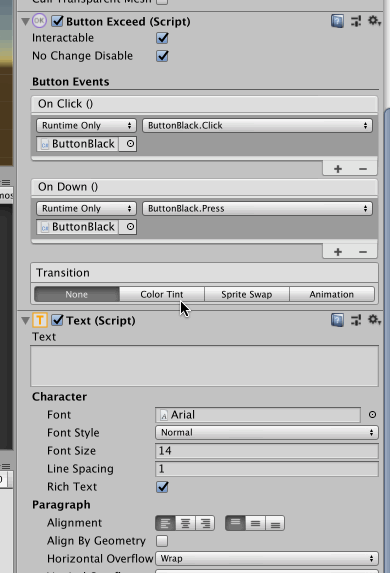

# ButtonExceed

Unity's `Button` the way I like it!

- A subclass of `Button`, so it remains compatible and updated with newer version of Unity.
- Separated `Down` and `Up`(Click) action. Usually you might want it to sound when down but take action on up, or take action immediately on down if it looks like a toggle or on-off switch.
- No `Highlighted` anything on the inspector. (I am making mainly a mobile game.)
- No `Navigation` anything on the inspector.
- No need for `Animator` for each button. I think it was an overkill. Uses just a simple legacy animation, which I have an another component `LegacyAnimator` to make it semi stateful like `Animator`.
- Multiple tint graphics in addition to "Target Graphic".
- Removed fields are actually still there and serialized, they are just being hidden by `OdinInspector`.
- `noChangeDisable` makes disabling button via `interactable` not causing it to be greyed out. Useful when you want to disable them on the scene transition and don't want to make it obvious to the player, but you will also use the disabled color normally.
- Rearranged things based on my preferences.
- There is an `Up` animation trigger added, but not yet implemented. (Will do later once I actually use it.)

## Note

- Normally if you subclass from Unity you are either must have your subclass's field appended to the end of superclass's inspector, or having to rewrite the editor from scratch. (There is a code in Unity's `Button` editor code that says look for all subclass's field and add them after drawing itself)
- I am writing everything from scratch, but with help from `OdinInspector` it does not take much time.

## Requirement

- `LegacyAnimator` (It is in the other folder)
- `OdinInsepctor` v1.1+ for attribute processor feature. (Add attributes to internal Unity fields)