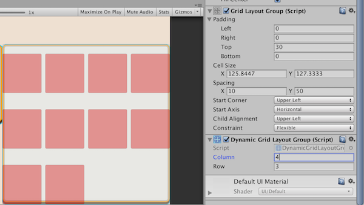

# Dynamic Grid Layout Group

Normally Grid Layout Group has non-flexible cell size for a good reason, it has Flexible, Fixed Column, and Fixed Row constraint. The weakness is that you cannot fill the area unlike Horizontal and Vertical Layout Group.

With this, instead of constraining only row or column, constrain both and let the cell size fill the parent. 

## Note

Cell size and constrain cannot be adjusted after applying this component along side with Grid Layout Group.

## Content
- The script
- Cool icon for the component. Click the C# paper icon on the script inspector to change it.