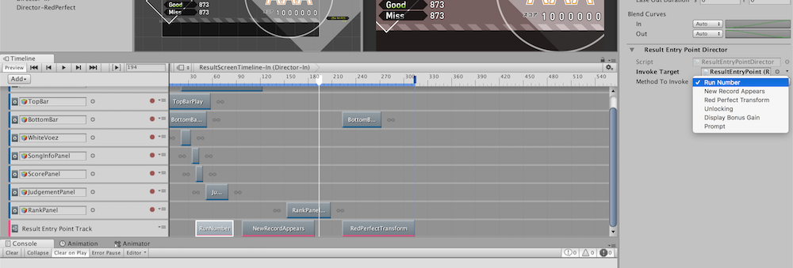

# InvokerPlayable




I made a yet another makeshift solution. A DIY class kit that could make your own method invoker track. The different is that it is very tightly connected to your game code.

This is a "kit" to create a timeline asset that can invoke parameterless methods in your game's class when the playhead arrives at the clip's beginning or running backward and hit the clip's end.

- Utilize generic for subclassing. You get a track hardwired to your class which is not as flexible as reflection-invoking or string-SendMessage, but the compiler can check if your class changed or become unlinked and I like it that way. You make 2 new files per one game class that you want to invoke its public methods. One for asset and one for it's own track.
- Does not use listener in the scene, connect with ExposedReference<T>.
- You could name the drop down for choosing the method however you want via the enum in the class that you made. Specify the enum-method pair via a dictionary hardwired in the class code.
- Selected enum becomes clip's name automatically. Makes it easier to see on the timeline.
- Supports only parameterless public method. I planned to add one more `Action<float>` invoker and the `float` argument would corresponds to clip's length.
- Invoke method with `OnBehaviorPlay`, so it would be still subject to the clip too short - might never play timeline sampling problem that one Unity team mentioned in this thread.

## Subclassing example

Subclassing is like this (C#6 syntax) Put the class you want to call its method in the generic and it would be available as an argument in `MethodPairings`.

```csharp
[System.Serializable]
public class ResultEntryPointDirector : InvokerPlayableAsset<ResultEntryPoint>
{
    private enum SelectedMethod
    {
        LogYo,
        RedPerfectTransform,
        Unlocking,
        DisplayBonusGain,
        Prompt
    }
    [SerializeField] SelectedMethod methodToInvoke;

    protected override Enum selectedMethod => methodToInvoke;
    protected override Dictionary<Enum, Action> MethodPairings(ResultEntryPoint resultEntryPoint) => new Dictionary<Enum, Action>()
    {
        [SelectedMethod.LogYo] = () => Debug.Log("yo")
        [SelectedMethod.RedPerfectTransform] = resultEntryPoint.RedPerfectTransformActivate
    };
}
```

There are 2 required abstract overrides, and you will need one another custom enum so that it would be your drop down by Unity's UI. The enum definition can be any name but should be private so that it won't pollute the namespace.

After this, connect the `ExposedReference<T>` in that appears in your clip's inspector with the thing in your scene, that will automatically becomes `MethodPairings`'s argument.
Name the `Enum` as anything that you like it to be named at the drop down.

(You see the pain point is you have to type the enum 2 times, but it is better than magic strings I think...)

What you get. You can see when the playhead crosses the clip it logs as specified in the dictionary : 


(Full size : https://gfycat.com/BeneficialDigitalFieldmouse)

(Actually you can't do this outside of Play Mode, since I have `Application.isPlaying` before the `.Invoke()` to prevent it wrecking havoc on your scene while previewing.)

You can just use Unity's general purpose Playable Track, or if you want your own exclusive track you require 3 more lines of code. This time put your asset class created earlier in the generic. please make a new file with the same name as class or Unity might complain : 

```csharp
using UnityEngine.Timeline;
[TrackClipType(typeof(ResultEntryPointDirector))]
public class ResultEntryPointTrack : InvokerPlayableTrack<ResultEntryPointDirector>{}
```

If you use my `InvokerPlayableTrack`, the currently selected enum becomes a clip's name automatically. Use `[TrackColor(R/255f, G/255f, B/255f)]` on your class to change its track color. (the default is pink)

## Warning

You should read this thread https://forum.unity.com/threads/timeline-events.479400/ as for why the event system is missing from Timeline. There are like 3 makeshift solutions in there. But the core problem is that Timeline is not a state machine. A marker that triggers things just does not fit in there. For example, with this InvokerPlayable if the clip is very short the event might not start at all if the game lags at that specific time. Timeline does not triggers, it just sample and do things based on the current position. I am just taking advantage of `OnBehaviourPlay` to make it looks like a trigger.