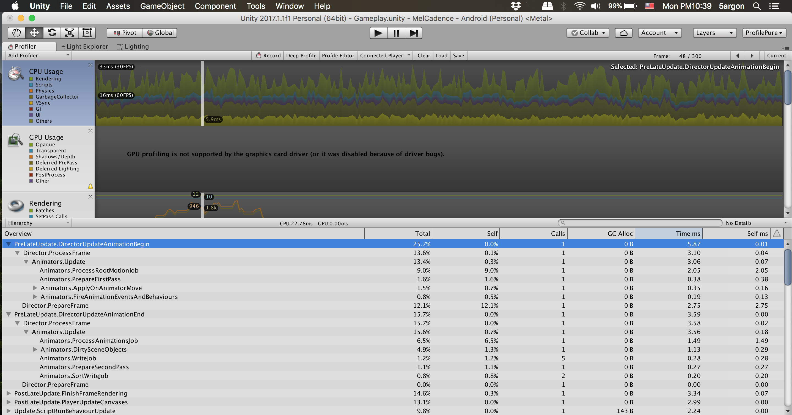

# LegacyAnimator



I have a scene with 60 Animators just because Unity says officially that legacy animator is not recommended for new projects! Boy! I should not have trusted Unity! The yellow chunk was entirely by Animators and it took 9ms combined. (16ms is the target time for 60FPS)

So this makes a legacy animation more usable and more like calling triggers to Animator's mechanim graph. In short it can recreates what I used to do in Animator's mechanim graph using only legacy animations. You can assign a custom "trigger name" to each legacy Animation clip and then use it like the new Animator.

## Features

- It automatically disable the Animation component at the end if it is not a looping one, and re-enable when you issue command LegacyAnimator.
- It can prime the start state to the first frame of any trigger. Useful for hiding things and wait for play but you don't want to hide them in Editor. In the new Animator, this is a bit difficult to do as you have to connect Start -> your first state with time scale 0, then connect to the same animation with time scale 1 with a trigger.
- In editor if you want to sync the Animator component use the context menu "Match Animation".
- Define a name for each animation like "Trigger" in mechanim. On Start(), it will prepare animations of that name. This means if you want to modify the animation in edit mode you cannot do that as they are no longer linked to your asset. (Right click and choose a context menu "Match Animation" if you want to do so)
- Friendly API

## Examples

```
legacyAnimator.SetTrigger("Play");
```

```
legacyAnimator.SetTrigger("Play").FollowedBy("FlashLoop");
```

```
legacyAnimator.Wait(0.12f).FollowedBy("Play");
```

```
legacyAnimator.SetTrigger("Play").AndWait(0.5f).FollowedBy("End");
```

```
legacyAnimator.SampleFirstFrame("Intro");
.
.
.
legacyAnimator.SetTrigger("Intro");
```


## Note

If you are moving from Animator (mechanim) remember that legacy animation has no concept of the "default value". It does not remember anything and just read a graph. You might have to add some "resets" on the first frame if you used to assume that.