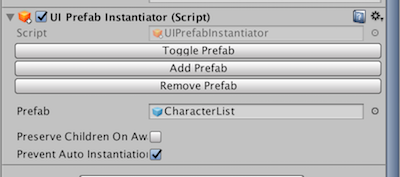
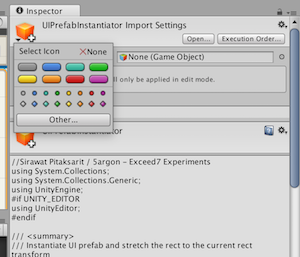

# PrefabInstantiator

When you want to nest prefabs, the usual problem is that the outer prefab will *bake* the inner prefab and render it disconnected to the original prefab.

This is the usual problem on UI components like buttons where you want it to look the same in the game, but at the same time you want to group the outer prefab by its task such as TitleCanvas or ModeSelectCanvas.

One way is to use Scene as a bigger unit of game objects and do multiple scene composing (All the things in the scene can then be non-prefab except buttons, etc.) , but if you want to use the prefab approach...

One approach is to remove that prefab and instantiate the prefab via code  by connecting the prefab to inspector. Doing this has several disadvantages : 

1. When developing you will want to see those prefabs in place. In the actual game you usually forgot to remove them or got confused.
2. You often accidentally Apply the outer ones, rendering the inner one disconnected.
3. Instantiating prefab via code means you have an additional ceremony of putting it in the right parent, size, scale, etc.

PrefabInstantiator grants you :

1. In development, you can add and remove prefabs easily via buttons.
2. Feel free to bake (apply) the prefab because in run time this will destroy all child and reinstantiate for you. (which will be fresh from the actual prefab.)
3. Coded for Unity UI, the instantiated prefab `RectTransform` will fill the parent which this component is attached automatically. (You cannot use this without `RectTransform`)
4. In the script you can keep the reference to the instantiator, then ask it about the actual object (e.g. `GetComponentOfInstantiated<T>`)
5. You can also manually instantiate the game objects. Useful for `LayoutGroup` where you want to create multiple of that prefabs in the code. `Instantiate<T>` also conveniently return the component you want on that instantiated prefab. Check `preventAutoInstantiation` if you want to do this.
6. A button to apply the instantiated prefab if you make changes. It apply the first one and correctly does not apply the outer prefab it resides in. (If you push Unity's Apply button, that is the case.)

NEW! Now works with non-UI stuff. But you have to check UI checkbox if you want to use it with UI.

## Requirement

- ButtonBool (It's in the other folder)
- If you have `OdinInspector`, then `ButtonBool` is not required.

## Bugs

- Toggle often stop working in edit mode because the script forgot it's variable after compilation. In that case, use Remove and then Toggle will work again.

## Bonus 

- Super cool icon which you can change in Unity here :

