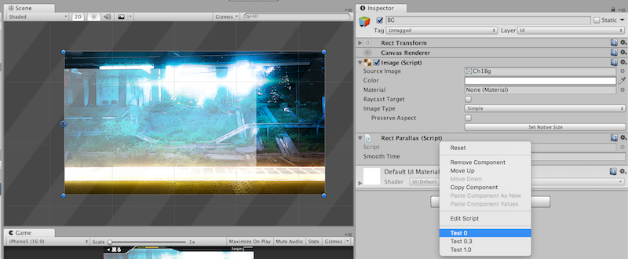
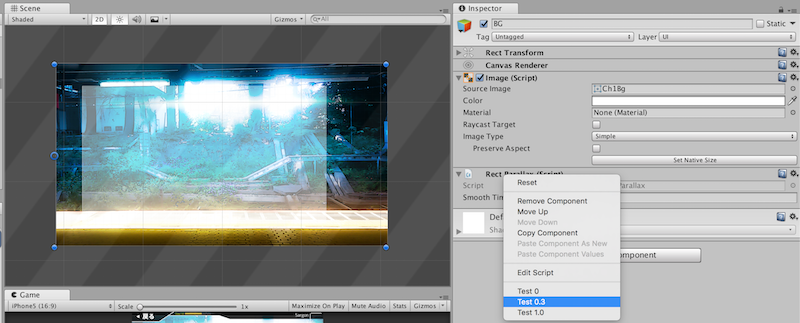
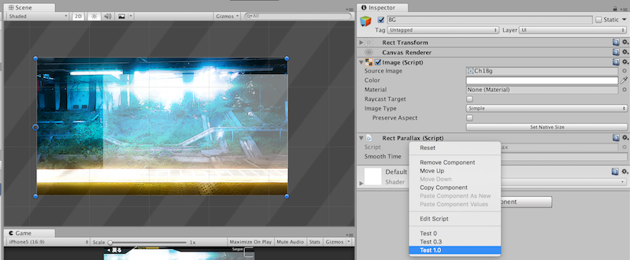

# RectParallax

By calling `ParallaxTo(float)` the rect will animate its `x` anchored position back to the left! If the argument is 0 it's left edge will be at parent's left edge. If 1, it's right edge will be at parent's right edge.

There is a `ContextMenu` debug methods provided to test things outside of play mode. See these screenshots.

